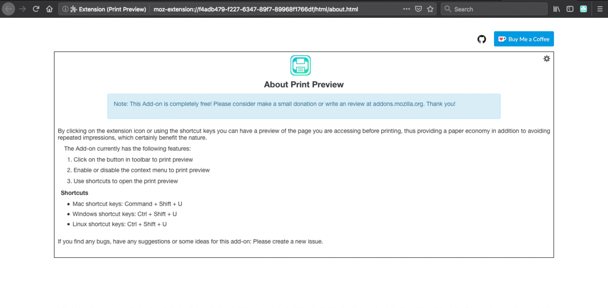

# Print Preview 

By clicking on the Add-on icon or using the shortcut keys you can have a preview of the page you are accessing before printing, thus providing a paper economy in addition to avoiding repeated impressions, which certainly benefit the nature.

## Requirements
* Firefox 58.0 or later

## Features
 1. Click on the button in toolbar to print preview
 2. Enable or disable the context menu to print preview
 3. Use shortcuts to open the print preview

## Shortcuts
* Mac shortcut keys: Command + Shift + U
* Windows shortcut keys: Ctrl + Shift + U
* Linux shortcut keys: Ctrl + Shift + U

## How Contribute
Have a suggestion, doubt or encountered an error? Please open a new [issue](https://github.com/jhonatasrm/print-preview/issues).

## Learn More 
To learn more about webextensions development, see this [Mozilla developer Network documentation](https://developer.mozilla.org/en-US/Add-ons/WebExtensions).

## License
This repository is available under the [Mozilla Public License, version 2.0](https://github.com/jhonatasrm/print-preview/blob/master/LICENSE)

